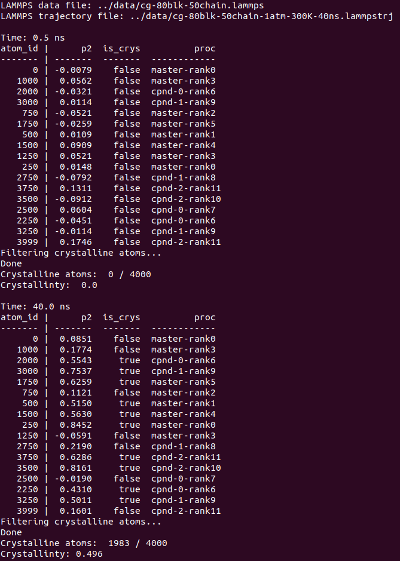
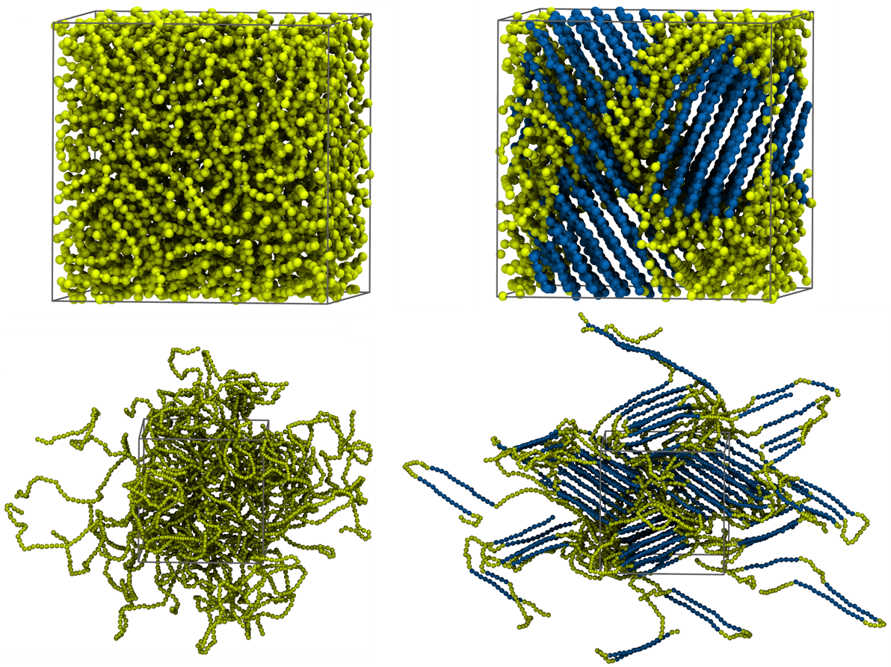

# Objective

A distributed computing algorithm is developed to identify the crystalline and amorphous phases in a coarse-grained polymer system (coarse-grained linear polyethylene).
Distributed computing is separately implemented in both MPI (message passing interface) mode and multiprocessing mode. 
The bin-table technique is used in both modes to further improve computing efficiency. 
The [local p2 order parameter][ref-1] is computed for every particle in system, which is used to determine if a particle should be assigned to the crystalline phase.

This postprocessing code was used in my research projects #6 and #7, as shown in [my webpage](https://liyiyang.weebly.com/).


# Prerequisites

### MPI mode

&nbsp;&nbsp;&nbsp;&nbsp;1. Open MPI or MPICH <br />
&nbsp;&nbsp;&nbsp;&nbsp;2. mpi4py <br />

These packages should be installed on the master node as well as all the worker nodes in your cluster.

In addition, master node and worker nodes should have access to the folder of this project through network file system (NFS), and any node should be able to passwordlessly ssh to any other node in your network. 
Please read this [tutorial](https://www-users.cs.york.ac.uk/~mjf/pi_cluster/src/Building_a_simple_Beowulf_cluster.html#_install_and_setup_the_network_file_system) for more information.

### Multiprocessing mode

&nbsp;&nbsp;&nbsp;&nbsp;None


# Usage

### MPI mode

Run distributed computing on all the worker nodes in your network.
The master node can also be utilized along side the worker nodes (this can be changed by modifying the  file.)
 
Usage:
```
cd run
mpiexec -np <n> python ../src/main.py mpi
```
or
```
cd run
mpiexec --hostfile ./hosts -np <n> python ../src/main.py mpi
```
where `<n>` is the number of physical cores in your cluster.
To use the `--hostfile` option, you need to modify the  file to accommodate the setting of your cluster.

### Multiprocessing mode

Run parallel computing only on your local node (ie, your workstation). Usage:
```
cd run
python ../src/main.py mp
```


# Code structure

. <br />
├── src <br />
│&nbsp;&nbsp;&nbsp;&nbsp;&nbsp;&nbsp;&nbsp;├── main.py <br />
│&nbsp;&nbsp;&nbsp;&nbsp;&nbsp;&nbsp;&nbsp;└── modules <br />
│&nbsp;&nbsp;&nbsp;&nbsp;&nbsp;&nbsp;&nbsp;&nbsp;&nbsp;&nbsp;&nbsp;&nbsp;&nbsp;&nbsp;&nbsp;├── __init__.py <br />
│&nbsp;&nbsp;&nbsp;&nbsp;&nbsp;&nbsp;&nbsp;&nbsp;&nbsp;&nbsp;&nbsp;&nbsp;&nbsp;&nbsp;&nbsp;├── parser.py <br />
│&nbsp;&nbsp;&nbsp;&nbsp;&nbsp;&nbsp;&nbsp;&nbsp;&nbsp;&nbsp;&nbsp;&nbsp;&nbsp;&nbsp;&nbsp;├── md_system.py <br />
│&nbsp;&nbsp;&nbsp;&nbsp;&nbsp;&nbsp;&nbsp;&nbsp;&nbsp;&nbsp;&nbsp;&nbsp;&nbsp;&nbsp;&nbsp;├── bin_table.py <br />
│&nbsp;&nbsp;&nbsp;&nbsp;&nbsp;&nbsp;&nbsp;&nbsp;&nbsp;&nbsp;&nbsp;&nbsp;&nbsp;&nbsp;&nbsp;├── identify_mpi.py <br />
│&nbsp;&nbsp;&nbsp;&nbsp;&nbsp;&nbsp;&nbsp;&nbsp;&nbsp;&nbsp;&nbsp;&nbsp;&nbsp;&nbsp;&nbsp;├── identify_mp.py <br />
│&nbsp;&nbsp;&nbsp;&nbsp;&nbsp;&nbsp;&nbsp;&nbsp;&nbsp;&nbsp;&nbsp;&nbsp;&nbsp;&nbsp;&nbsp;├── p2_parameters.py <br />
│&nbsp;&nbsp;&nbsp;&nbsp;&nbsp;&nbsp;&nbsp;&nbsp;&nbsp;&nbsp;&nbsp;&nbsp;&nbsp;&nbsp;&nbsp;└── postprocess.py <br />
├── data <br />
│&nbsp;&nbsp;&nbsp;&nbsp;&nbsp;&nbsp;&nbsp;├── cg-80blk-50chain.lammps <br />
│&nbsp;&nbsp;&nbsp;&nbsp;&nbsp;&nbsp;&nbsp;└── cg-80blk-50chain-1atm-300K-40ns.lammpstrj <br />
├── run <br />
│&nbsp;&nbsp;&nbsp;&nbsp;&nbsp;&nbsp;&nbsp;├── hosts <br />
│&nbsp;&nbsp;&nbsp;&nbsp;&nbsp;&nbsp;&nbsp;├── input <br />
│&nbsp;&nbsp;&nbsp;&nbsp;&nbsp;&nbsp;&nbsp;├── screen_output.png <br />
│&nbsp;&nbsp;&nbsp;&nbsp;&nbsp;&nbsp;&nbsp;└── image.png <br />
└── vmd_scripts <br />
&nbsp;&nbsp;&nbsp;&nbsp;&nbsp;&nbsp;&nbsp;&nbsp;&nbsp;├── color_scale.vmd <br />
&nbsp;&nbsp;&nbsp;&nbsp;&nbsp;&nbsp;&nbsp;&nbsp;&nbsp;└── setuserfield.vmd


#### src/main.py

Main script that initializes input parameters, and launches either MPI or multiprocessing jobs to identify crystalline particles in polymer system.

#### src/modules/parser.py

Script providing functions to read parameters from the input file 'input'.

#### src/modules/md_system.py

A class to store molecular information of a coarse-grained linear polyethylene system.

#### src/modules/bin_table.py

A class to generate a bin table for a polymer system.

#### src/modules/identify_mpi.py

Script using MPI to identify possible crystalline particles, utilizing all worker nodes in cluster.

#### src/modules/identify_mp.py

Script using multiprocessing to identify possible crystalline particles, utilizing only master node.

#### src/modules/p2_parameters.py

Script to calculate local p2 order parameter for each atom i in a list of local particles to be handled by a parallel process.

#### src/modules/postprocess.py

Script to run on master process, that completes the identification of crystalline particles.

#### data/cg-80blk-50chain.lammps

A LAMMPS data file for a reference state of a polymer system.

#### data/cg-80blk-50chain-1atm-300K-40ns.lammpstrj

A LAMMPS trajectory file containing two snap shots (or time steps) of the evolution of the polymer system defined by the LAMMPS data file.

#### run/hosts

Configuration file listing the nodes that will be used for distributed computing.

#### run/input

Input file containing required parameters.

#### run/screen_output.png

A screenshot of output for the MPI mode.

#### run/image.png

An example randering of the polymer system with VMD. <br />

#### vmd_scripts/color_scale.vmd

A VMD script to define a custom color scale used for rendering crystalline particles (blue) and amorphous particles (yellow) at all time steps listed in the trajectory file.

#### vmd_scripts/setuserfield.vmd

A VMD script to set the values of 'user' field as the values in the 'vx' column of LAMMPS trajectory file, at every time step listed in the trajectory file.

### File output

After executing the code, an 'output' folder will be created under the 'run' folder, which contains three files:

. <br />
└── run <br />
&nbsp;&nbsp;&nbsp;&nbsp;&nbsp;&nbsp;&nbsp;&nbsp;└── output <br />
&nbsp;&nbsp;&nbsp;&nbsp;&nbsp;&nbsp;&nbsp;&nbsp;&nbsp;&nbsp;&nbsp;&nbsp;&nbsp;&nbsp;&nbsp;&nbsp;├── identified.lammpstrj <br />
&nbsp;&nbsp;&nbsp;&nbsp;&nbsp;&nbsp;&nbsp;&nbsp;&nbsp;&nbsp;&nbsp;&nbsp;&nbsp;&nbsp;&nbsp;&nbsp;├── identified_crystalline_atoms <br />
&nbsp;&nbsp;&nbsp;&nbsp;&nbsp;&nbsp;&nbsp;&nbsp;&nbsp;&nbsp;&nbsp;&nbsp;&nbsp;&nbsp;&nbsp;&nbsp;└── crystallinty

#### run/output/identified.lammpstrj

A new LAMMPS trajectory file, using a 'vx' column to indicate if a particle belongs to crystalline phase.

#### run/output/identified_crystalline_atoms

Each line lists the IDs of particles belongs to a crystalline chunk, for every time step listed in the trajectory file.
IDs are sorted according to particle connectivity.

#### run/output/crystallinty

Lists the crystallinty of polymer system at every time listed in the trajectory file.


# Example screen output (MPI mode)

With a cluster with a master node and two slave nodes, as listed in the  file where each node has two physical cores, my computation is launched by
```
cd run
mpiexec --hostfile ./hosts -np 6 python ../src/main.py mpi
```

which gives following screen output




# Visualization

I use VMD to visualize the identified polymer system.
For this, I installed:

&nbsp;&nbsp;&nbsp;&nbsp;1. Tachyon <br />
&nbsp;&nbsp;&nbsp;&nbsp;2. VMD

Then open the VMD GUI interface with
```
cd run
vmd output/identified.lammpstrj 
```
is opened. Now modify some settings as stated below: 

'Display' -> check 'Orthographic' <br />
'Display' -> uncheck 'Depth Cueing' <br />
'Display' -> 'Axes' -> 'Off'

'Extensions' -> 'Tk Console', this opens a console, from where execute these commands:
```
  play ../vmd_scripts/color_scale.vmd
  play ../vmd_scripts/setuserfield.vmd
  pbc box -center unitcell -shiftcenter {0.168269 0.168269 0.168269}  -color gray
```

'Graphics' -> 'Representations...', this opens a new panel: <br />
&nbsp;&nbsp;&nbsp;&nbsp;Modify 'Coloring Method' to 'Trajectory' -> 'User' -> 'User' <br />
&nbsp;&nbsp;&nbsp;&nbsp;Modify 'Drawing Method' -> 'VDW' (Sphere Scale 0.6) <br />
&nbsp;&nbsp;&nbsp;&nbsp;Modify 'Material' -> 'AOShiny' <br />
&nbsp;&nbsp;&nbsp;&nbsp;Click  'Create Rep' <br />
&nbsp;&nbsp;&nbsp;&nbsp;Modify 'Drawing Method' -> 'DynamicBonds' (Distance Cutoff 2.7)

'Display' -> 'Display Settings' -> check 'Shadows' On <br />
'Display' -> 'Display Settings' -> Check 'Amb. Occl.' On

'Graphics' -> 'Colors...' -> Categories 'Display' -> Names 'Background' -> Colors '8 White'

'Extensions' -> 'Tk Console', execute following command to render an image file:
```
   render Tachyon vmdscene.dat tachyon -aasamples 24 -fullshade -res 1000 1000 %s -format PNG -o image.png
```
Here is the rendered image, for time step 0.5 ns (left) and 40.0 ns (right), where yellow beads belong to amorphous phase and blue beads belong to crystalline phase.



[ref-1]: http://aip.scitation.org/doi/abs/10.1063/1.3608056?journalCode=jcp
